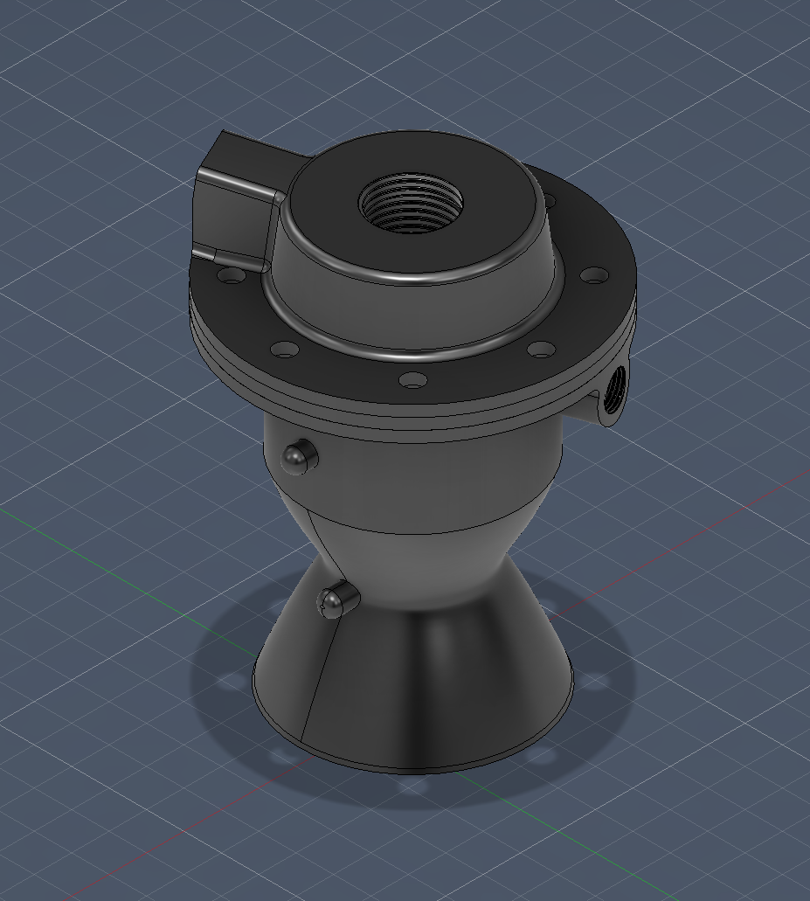
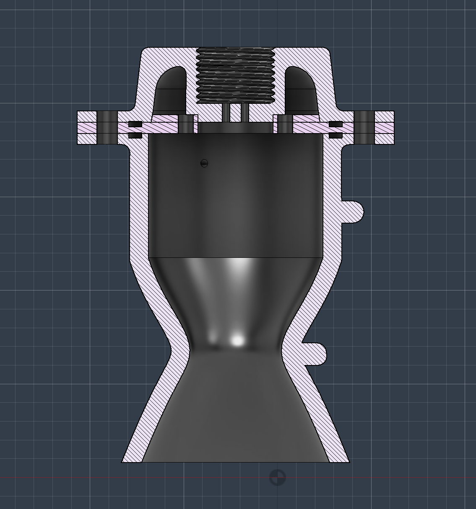

# Open-Cycle-Liquid-Bipropellant-Rocket-Engine-Prototype

## Overview
This repository documents the ongoing design, engineering, and manufacturing process of a liquid bipropellant rocket engine prototype. The engine utilizes an open-cycle configuration (blowdown system) chosen for its manufacturability and reliability during the prototyping phase. The primary objective is to successfully design, assemble, and static-fire the engine, serving as a comprehensive learning platform for propulsion engineering, fluid dynamics, and high-pressure system safety.

## CAD Design & Engineering Drawings
Here is the current CAD design of the combustion chamber, nozzle throat, and injector assembly.

  
   
  <em>Figure 1: Full isometric view of the engine assembly.</em>

  
   
  <em>Figure 2: Sectional view showing internal geometry of the combustion chamber and nozzle.</em>

---

## Target Technical Specifications
The core thermodynamic calculations define the geometry of the engine based on the desired thrust.

* **Target Thrust ($F$): *1,8 kN* 
* **Propellants:** Ethanol (Fuel) & Oxygen (Oxidizer)
* **Pressurant Gas:** Nitrogen ($N_2$)
* **Target Chamber Pressure ($P_c$): *30 bar* 

### Core Equations Used for Geometry
The throat area ($A_t$) was derived using the thrust equation:
$$F = P_c \cdot A_t \cdot C_f$$
Where $C_f$ is the thrust coefficient, approximated to $1.3$.

For the expansion ratio ($\epsilon = A_e / A_t$), we calculated: *4*
Resulting in an exit area ($A_e$) of: *1846,16 mm^2*

---

## Instrumentation and Telemetry
To monitor the engine's performance and ensure safe operation during hot-fire tests, a comprehensive sensor suite is planned. To protect sensitive electronics from extreme heat, physical standoff methods (like "pigtail" tubing) are utilized.

* **Nozzle Throat Temperature:** K-Type Thermocouple (0-800°C), secured externally with a clamp.
* **Combustion Chamber Temperature:** Positioned externally on the chamber wall, equidistant between the throat and the mounting flange.
* **Combustion Chamber Pressure (Post-Injector):** High-pressure transducer. To prevent heat damage, the sensor is mounted on a 6x1mm stainless steel "pigtail" standoff tube protruding from the chamber.
* **Propellant Line Pressures (Pre-Injector):** Two transducers monitoring Ethanol and Oxygen feed pressures independently.
* **Visual Monitoring:** Remote high-speed video camera for test stand observation.

---

## Fluid System & P&ID (Piping and Instrumentation)
The feed system uses a pressurized nitrogen blowdown mechanism to force propellants into the combustion chamber.

### High-Level P&ID Block Diagram
1. Nitrogen Pressure Regulator (200 bar $\rightarrow$ 30 bar)
2. Manual Isolation Valve
3. Check Valve (One-way)
4. Solenoid Valves (Main Flow)
5. Oxygen Pressure Regulator (200 bar $\rightarrow$ 30 bar)
6. Purge Solenoid Valve
7. Ethanol Pressure Transducer
8. Oxygen Pressure Transducer
9. Thermocouples (Throat & Chamber)
10. Chamber Pressure Transducer (Post-Injector)
---
### Hardware & Materials Selection
* **Ethanol Feed Lines:** 1SN hydraulic hoses with metal wire braiding for superior pressure resistance.
* **Oxygen Feed Lines:** Teflon (PTFE) core hoses with stainless steel outer braiding to ensure material compatibility and prevent oxidation hazards.
* **Main Control Valves:** Custom-actuated 1/2" DN15 stainless steel ball valves (PN63 rated). *Crucial Note: These are 3-piece valves to allow complete disassembly and cleaning (oxygen-safe degreasing), replacing standard rubber O-rings with oxygen-compatible seals to prevent spontaneous combustion.*
* **Fittings & Connections:** AN-6 to 1/2" NPT steel adapters and high-pressure stainless check valves.

---

## Mechanical Assembly & Sealing
The engine core consists of three main machined parts: the Injector Cap, the Injector Plate, and the Nozzle/Combustion Chamber.

* **Fasteners:** 8x M5 Burnished Steel Bolts (chosen for higher tensile strength compared to standard stainless steel).
* **Nuts:** M5 Burnished Steel Hex Nuts.
* **Locking Mechanism:** Nord-Lock NL5 wedge-locking washers to prevent loosening under extreme acoustic and vibration loads.
* **Sealing:** Solid copper crush gaskets (O-rings) placed between the three main mating surfaces to ensure high-pressure gas sealing.

---

## 🛠️ Prototyping & Manufacturing

Before moving to expensive metal machining, the engine's core components (injector, chamber, and nozzle) were 3D printed in plastic. This crucial step allows us to:
* Validate the CAD geometry in the real world.
* Check tolerances for mating surfaces and fastener alignment.
* Verify the assembly sequence and tool accessibility.

  
   
  <em>Figure 1: 3D printed plastic prototype used for physical design validation and assembly testing.</em>

---

## ⚠️ Safety Disclaimer
**This is a high-risk engineering project.** It involves handling highly pressurized gases (up to 200 bar), cryogenic/reactive oxidizers, and extreme combustion temperatures. All design decisions prioritize safety. Test stand operations will strictly utilize remote firing systems and physical blast barriers. Do not attempt to replicate this system without proper engineering oversight and strict adherence to local safety regulations.
